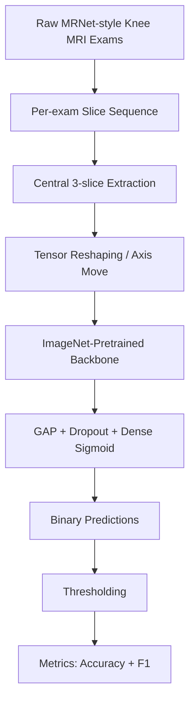
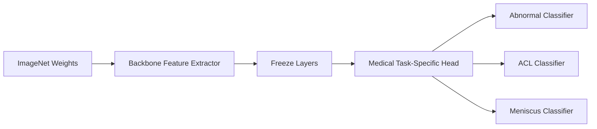
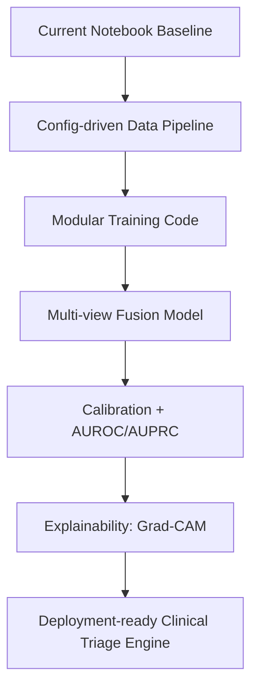

# CNN_MRNET
## **From MRI Slices to Clinical Signals: A Deep Learning Story for Knee Injury Triage**

  
  
  

---

## 🧠 Project Storyline

A knee MRI exam is not a single image—it is a **sequence of slices**, each carrying fragments of anatomical evidence.
In clinical workflows, these slices must be translated into confident decisions under time pressure.

This repository represents a practical DL approach to that challenge:

- use **pretrained CNN backbones** as representation engines,
- adapt MRI exams into CNN-friendly tensors,
- and train pathology-specific classifiers to flag:
  - **Abnormality**
  - **ACL tear**
  - **Meniscus tear**

In short: **high-capacity vision models + focused medical labels = scalable triage intelligence**.

---

## 🎯 What this repository contains

- `DenseNet169.ipynb`  
  End-to-end training/evaluation notebook using **DenseNet169** transfer learning.

- `nasnet.ipynb`  
  Alternate experiment notebook (name suggests NASNet exploration; current model-definition cell uses **VGG19** as backbone).

- `vgg16.pdf`  
  Supporting project/report document.

---

## 🧪 End-to-End ML/DL Pipeline

### 1) Data ingestion
MRI studies are loaded from MRNet-style `train/valid` structures with per-plane organization.

### 2) 2.5D representation with central slices
A compact context window is formed via three middle slices:

- `x[mid-1]`
- `x[mid]`
- `x[mid+1]`

This preserves local volumetric context while remaining compatible with 2D transfer-learning backbones.

### 3) Tensor preparation
Input arrays are reshaped (axis movement) so each exam maps to CNN-compatible channel ordering.

### 4) Transfer learning head
Both notebook pipelines follow a strong fine-tuning baseline pattern:

- Freeze pretrained convolutional backbone
- Add `GlobalAveragePooling2D`
- Add `Dropout(0.6)`
- Add `Dense(1, sigmoid)` output

### 5) Training strategy
Separate binary models are trained across labels and MRI views with early stopping on validation loss.

### 6) Evaluation
Probabilities are thresholded into class decisions and scored with:

- Accuracy
- F1 Score

---

## 🏗️ Model Strategy Visualization

---

## 🔍 Why this approach works

✅ **Data-efficient learning**: Transfer learning reduces the need for very large labeled medical datasets.  
✅ **Fast convergence**: Frozen backbone + lightweight head is stable and practical.  
✅ **Task decomposition**: Separate pathology classifiers simplify optimization and interpretation.  
✅ **Notebook transparency**: Easy to inspect preprocessing and model behavior end-to-end.

---

## ⚠️ Current constraints

- Hardcoded Google Drive / Colab-centric dataset paths
- Research-notebook structure (not yet production-packaged)
- 3-slice approximation does not fully exploit full 3D MRI context
- Manual thresholds (not probability-calibrated)
- Limited experiment tracking / reproducibility controls

---

## 🚀 High-Impact Next Steps

1. Refactor notebooks into modular `src/` training/inference scripts.
2. Parameterize data paths and experiment configs.
3. Add robust validation protocol and seeded reproducibility.
4. Report richer metrics (AUROC, AUPRC, sensitivity/specificity).
5. Explore true multi-view fusion and 3D/2.5D architectures.
6. Add explainability for clinical trust and model auditing.
7. Integrate experiment tracking (MLflow/W&B).

---

## 🖼️ Conceptual Snapshot

  
   
  Representative MRI-style imaging (illustrative only).

---

## 📌 Quick Start (for contributors/researchers)

1. Open either notebook in Jupyter or Colab.
2. Update dataset paths to your local or cloud MRNet-formatted directory.
3. Run preprocessing, model build, training, and evaluation cells in order.
4. Compare backbone behavior and tune decision thresholds per task.

---

## 🌟 Vision

This project is a meaningful baseline for **AI-assisted musculoskeletal radiology triage**.
With better packaging, calibration, fusion modeling, and explainability, it can evolve from a strong academic prototype into a practical clinical decision-support component.

**If your goal is impactful medical AI, this repo is an excellent foundation to build on.**
