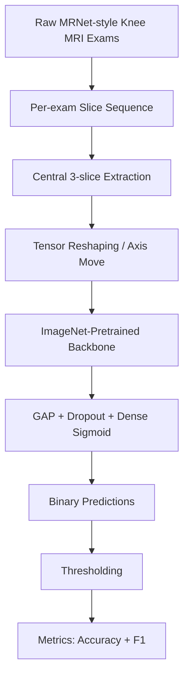
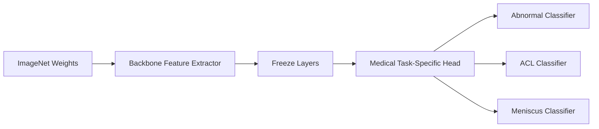
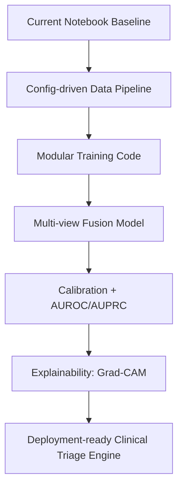

# CNN_MRNET
## **From MRI Slices to Clinical Signals: A Deep Learning Story for Knee Injury Triage**

  
  
  

---

## 🧠 Project Storyline

A knee MRI exam is not a single image—it is a **sequence of slices**, each carrying fragments of anatomical evidence.
In clinical workflows, these slices must be translated into confident decisions under time pressure.

This repository represents a practical DL approach to that challenge:

- use **pretrained CNN backbones** as representation engines,
- adapt MRI exams into CNN-friendly tensors,
- and train pathology-specific classifiers to flag:
  - **Abnormality**
  - **ACL tear**
  - **Meniscus tear**

In short: **high-capacity vision models + focused medical labels = scalable triage intelligence**.

---

## 🎯 What this repository contains

- `DenseNet169.ipynb`  
  End-to-end training/evaluation notebook using **DenseNet169** transfer learning.

- `nasnet.ipynb`  
  Alternate experiment notebook (name suggests NASNet exploration; current model-definition cell uses **VGG19** as backbone).

- `vgg16.pdf`  
  Supporting project/report document.

---

## 🧪 End-to-End ML/DL Pipeline

### 1) Data ingestion
MRI studies are loaded from MRNet-style `train/valid` structures with per-plane organization.

### 2) 2.5D representation with central slices
A compact context window is formed via three middle slices:

- `x[mid-1]`
- `x[mid]`
- `x[mid+1]`

This preserves local volumetric context while remaining compatible with 2D transfer-learning backbones.

### 3) Tensor preparation
Input arrays are reshaped (axis movement) so each exam maps to CNN-compatible channel ordering.

### 4) Transfer learning head
Both notebook pipelines follow a strong fine-tuning baseline pattern:

- Freeze pretrained convolutional backbone
- Add `GlobalAveragePooling2D`
- Add `Dropout(0.6)`
- Add `Dense(1, sigmoid)` output

### 5) Training strategy
Separate binary models are trained across labels and MRI views with early stopping on validation loss.

### 6) Evaluation
Probabilities are thresholded into class decisions and scored with:

- Accuracy
- F1 Score

---

## 🏗️ Model Strategy Visualization

---

## 🔍 Why this approach works

✅ **Data-efficient learning**: Transfer learning reduces the need for very large labeled medical datasets.  
✅ **Fast convergence**: Frozen backbone + lightweight head is stable and practical.  
✅ **Task decomposition**: Separate pathology classifiers simplify optimization and interpretation.  
✅ **Notebook transparency**: Easy to inspect preprocessing and model behavior end-to-end.

---

## ⚠️ Current constraints

- Hardcoded Google Drive / Colab-centric dataset paths
- Research-notebook structure (not yet production-packaged)
- 3-slice approximation does not fully exploit full 3D MRI context
- Manual thresholds (not probability-calibrated)
- Limited experiment tracking / reproducibility controls

---

## 🚀 High-Impact Next Steps

1. Refactor notebooks into modular `src/` training/inference scripts.
2. Parameterize data paths and experiment configs.
3. Add robust validation protocol and seeded reproducibility.
4. Report richer metrics (AUROC, AUPRC, sensitivity/specificity).
5. Explore true multi-view fusion and 3D/2.5D architectures.
6. Add explainability for clinical trust and model auditing.
7. Integrate experiment tracking (MLflow/W&B).

---

## 🖼️ Conceptual Snapshot

  
   
  Representative MRI-style imaging (illustrative only).

---

## 📌 Quick Start (for contributors/researchers)

1. Open either notebook in Jupyter or Colab.
2. Update dataset paths to your local or cloud MRNet-formatted directory.
3. Run preprocessing, model build, training, and evaluation cells in order.
4. Compare backbone behavior and tune decision thresholds per task.

---

## 🌟 Vision

This project is a meaningful baseline for **AI-assisted musculoskeletal radiology triage**.
With better packaging, calibration, fusion modeling, and explainability, it can evolve from a strong academic prototype into a practical clinical decision-support component.

**If your goal is impactful medical AI, this repo is an excellent foundation to build on.**
# CNN_MRNET: Deep Learning for Knee MRI Triage

## Why this project matters
Every knee MRI study contains dozens of slices and subtle visual cues. Radiologists are excellent at this work, but the volume of studies in real-world workflows creates pressure for fast and reliable triage. This repository explores a **transfer-learning-first** deep learning pipeline to classify MRNet-style knee MRI scans into three clinically relevant outcomes:

- **Abnormality detection**
- **ACL tear detection**
- **Meniscus tear detection**

The core story of this repo is simple and practical:
> start from strong ImageNet backbones, adapt them to 3-slice MRI inputs, train task-specific binary classifiers, and evaluate each pathology stream independently.

---

## Project narrative (ML/DL storyline)

This work follows a common and highly effective medical imaging pattern:

1. **Domain framing**: Knee MRI classification as binary decision tasks.
2. **Data shaping**: Convert volumetric stacks into compact 2D multi-channel inputs using central-slice extraction.
3. **Representation transfer**: Reuse pretrained CNN backbones to reduce data hunger and improve convergence.
4. **Task decomposition**: Train separate classifiers for abnormal / ACL / meniscus labels.
5. **Thresholded inference + metrics**: Convert probabilities to decisions and evaluate with accuracy + F1.

This structure makes the pipeline interpretable, reproducible in notebooks, and extensible for future experimentation.

---

## What is in this repository

- `DenseNet169.ipynb` — end-to-end notebook pipeline using **DenseNet169** as pretrained feature extractor and a custom binary head.
- `nasnet.ipynb` — parallel notebook variant (filename suggests NASNet experimentation; current model construction cell uses **VGG19** transfer learning).
- `vgg16.pdf` — supplementary document/report artifact.

---

## Technical pipeline

### 1) Data ingestion and view-wise loading
The notebooks load MRI studies from MRNet-style directory trees (`train/valid` and plane folders such as sagittal/axial/coronal), iterate across files, and assemble per-exam tensors.

### 2) 3-slice extraction strategy
A helper function selects three central slices from each study:
- `x[mid-1]`, `x[mid]`, `x[mid+1]`

This is a lightweight approximation of volumetric context that keeps training computationally manageable.

### 3) Tensor reshaping for CNN backbones
Data is converted and axis-moved so each exam becomes an image-like tensor suitable for ImageNet-pretrained 2D CNNs.

### 4) Transfer learning model heads
Both notebooks freeze the pretrained backbone and attach:
- GlobalAveragePooling2D
- Dropout (0.6)
- Dense(1, sigmoid)

Loss/optimization:
- Binary crossentropy
- Adam optimizer
- Accuracy metric

### 5) Training regime
For each anatomy view and pathology label, separate models are trained with early stopping on validation loss.

### 6) Evaluation strategy
Predicted probabilities are thresholded into binary labels, then scored using:
- Accuracy
- F1 score

---

## Strengths of the approach

- **Transfer learning efficiency**: useful for moderate-size medical datasets.
- **Clear modularity**: separate training by pathology and plane simplifies debugging.
- **Clinical alignment**: targets correspond to clinically meaningful findings.
- **Notebook transparency**: easy to trace every preprocessing and modeling step.

---

## Current limitations (important)

- Paths are hardcoded for Google Drive/Colab-style environments.
- Notebooks are research-style and not yet packaged as reusable modules/scripts.
- 3-slice sampling may miss broader 3D context from full volumes.
- Threshold values are manually chosen rather than calibrated per task.
- Limited experiment tracking/reproducibility metadata (seed control, config files, artifact logging).

---

## Recommended next steps (high impact)

1. **Refactor into a package** (`src/`, `configs/`, `train.py`, `infer.py`) for reproducible runs.
2. **Add dataset abstraction** with configurable local/cloud paths.
3. **Introduce proper validation protocol** (stratification, cross-validation where feasible).
4. **Calibrate probabilities** (Platt scaling / isotonic) and report AUROC/AUPRC.
5. **Move to multi-view fusion** (sagittal + axial + coronal in a single architecture).
6. **Explore 3D or 2.5D upgrades** for richer context.
7. **Add explainability** (Grad-CAM) for clinical trust and error analysis.
8. **Track experiments** with MLflow/W&B and lock dependencies with an environment file.

---

## How to use this repo today

1. Open notebooks in Jupyter/Colab.
2. Update dataset paths to your MRNet-compatible directory.
3. Run cells sequentially for preprocessing, training, and evaluation.
4. Compare backbone behavior between notebook variants and tune thresholds.

---

## Vision
This repository represents an applied DL prototype for musculoskeletal MRI intelligence. With engineering hardening (data pipelines, experiment management, calibration, and deployment interfaces), it can evolve from a notebook experiment into a clinically relevant AI triage component.

If your goal is medical imaging impact, this codebase is a strong baseline to build from.
